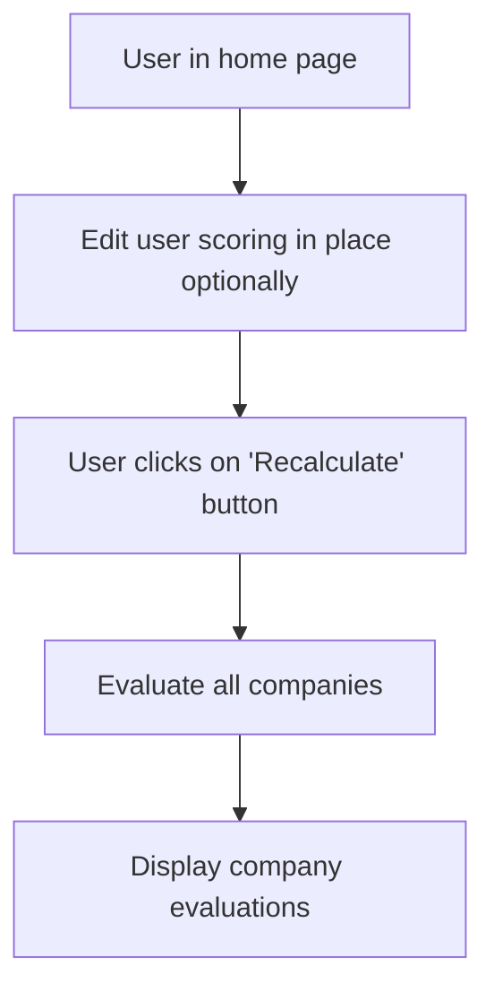
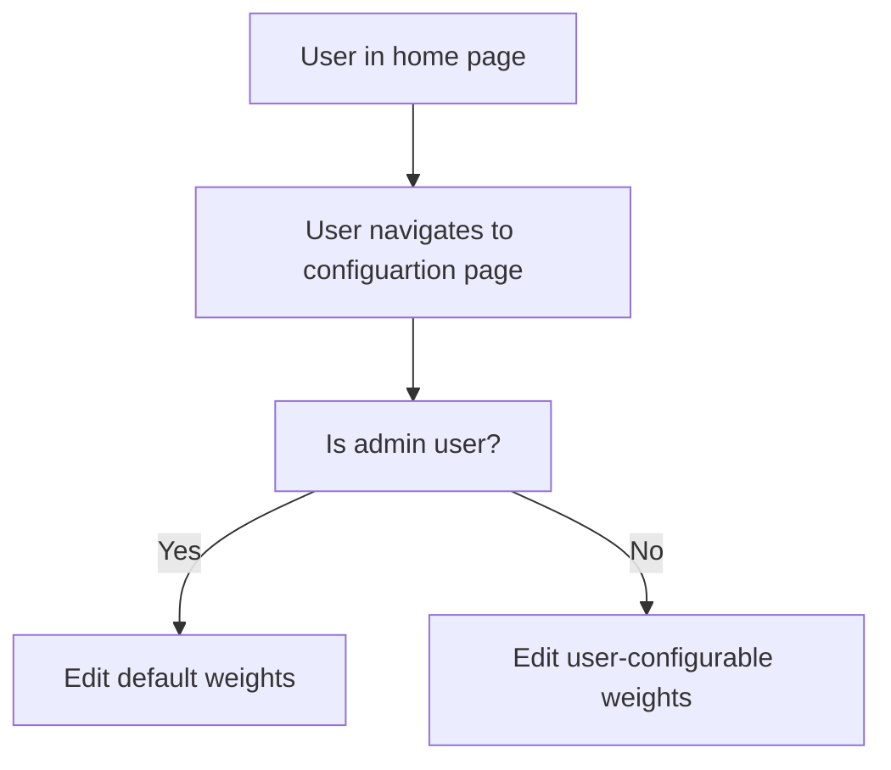
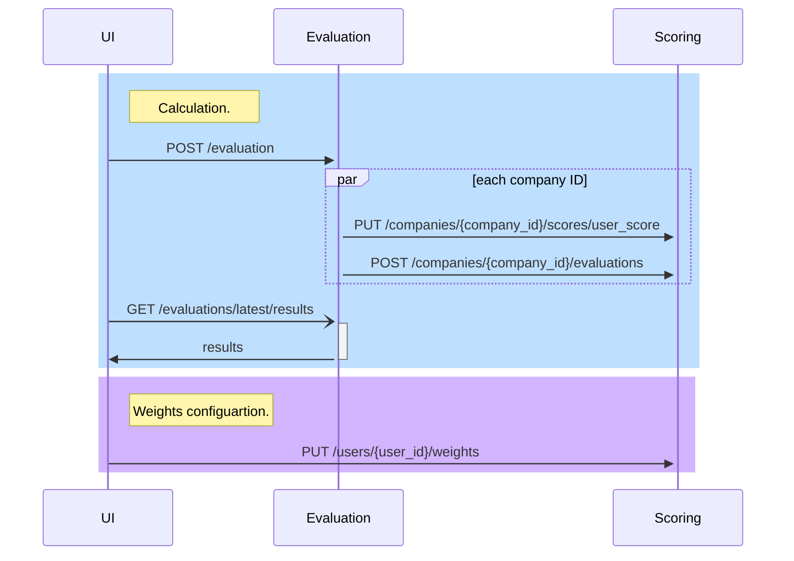

# Company evaluation

## Summary

The purpose of the code is to follow a requirement for calculating and presenting the scores of companies.

## Get started
```bash
git clone https://github.com/guyslab/company_evaluation.git
cd company_evaluation
docker-compose up
```
navigate to http://localhost:8092
At the top left switch between admin / user modes
At the top left switch between home and configuration pages
At home page - request and display company evaluations
At configuation page modify weights for calculations


## Activities

### Calculation



### Configuration



## Components & Flow

The implmentation consists of the following components:

* UI - for the user to configure weights, request evaluation, and see the scores.
* Evaluation service - to orchestrate the calculation process and provide the results
* Scoring service - for single-company score calculation, and weights



## Comments & assumptions:

1. On production, there may be an extra API Gateway component to handle user authorization, depending how generic the product's permissions are (for instance if all the system's permissions can be defined in terms of roles - admin, etc.). For now, user authorization is mocked at frontend level only, and user ID is received at the endpoint in a 'x-user-id' header.
2. By the first required interface (implementation detail) - *API for calculating a company score by id*, the single-company scoring method should be invoked synchronously. If I were to design the solution I would suggest invoking asyncronously for greater scalability.
3. Scoring service should persist company state. Such company state should be prefetched from a "Company service" (such as by events, ETLs, etc.) not implmented here.
4. Evaluation service should persist all the company IDs in order to orchestrate the batch operation. As in 3 above, such list should be prefetched from a "Company service" not implemented here.